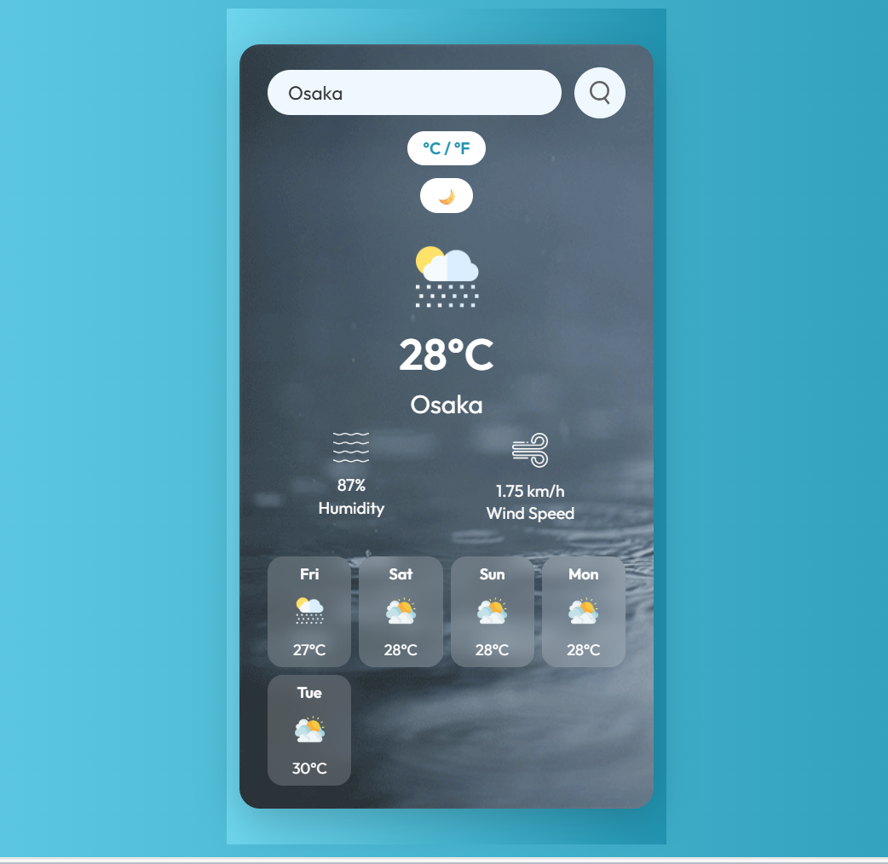
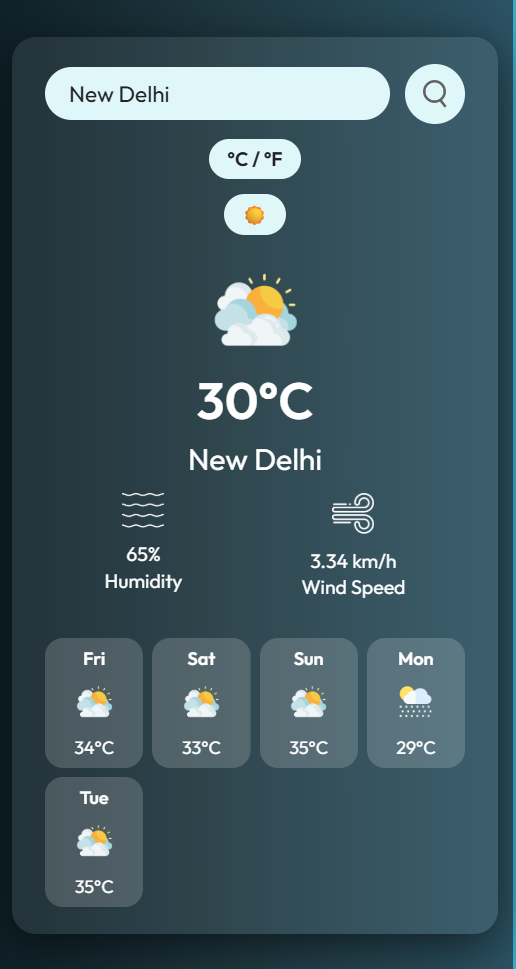
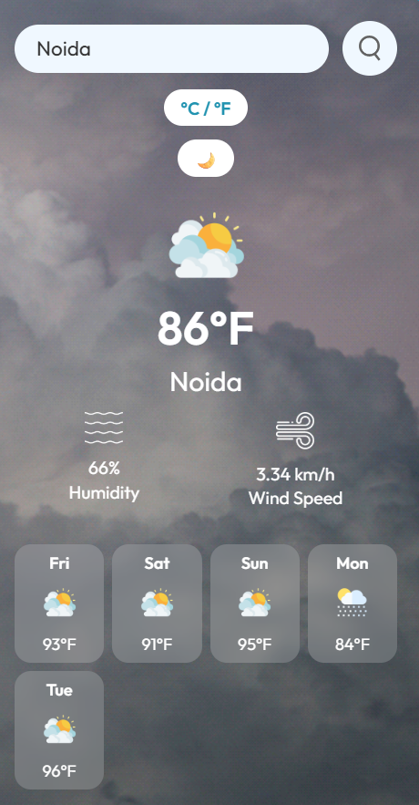

## WEATHER FORECAST ⛅

A sleek and responsive weather app built with HTML, CSS, and JavaScript, using the OpenWeatherMap API to fetch real-time weather data by city name.

### 🚀 Features

- 🌍 Search weather by city name

- 🌡️ Display temperature, humidity, and wind speed

- ⛅ Dynamic weather icons (clear, rain, mist, etc.)

- ❌ Handles invalid city name gracefully with error message

- 🎨 Responsive and modern UI design

- Dark/Light theme switch

### 🔧 Tech Stack

- Frontend: HTML5, CSS3, JavaScript (Vanilla)

- API: OpenWeatherMap API

### 📸 Screenshots

#### Light Mode

#### Dark Mode

#### From °C 

